# AIA Diagrams (Mermaid)

This document provides Mermaid diagrams that summarize the full AIA system from the tutorial slides: architecture, tech stack, workflow, retrieval/action algorithms, data model, and reliability controls.

## 1) System Architecture (C4-style container view)

```mermaid
flowchart LR
  user[User] --> ui[Streamlit UI\n(Test UI)]
  user --> api[FastAPI API\n/qa-intake /upload /status]
  ui --> api

  api --> wf[Workflow Orchestrator\n(Node Pipeline)]
  wf --> llm[OpenAI LLM\nPlanning + Enrichment]
  wf --> qdrant[(Qdrant\nVector DB)]
  wf --> redis[(Redis\nCache + Status + Rate Limit)]
  wf --> mongo[(MongoDB\nConversation Memory)]

  wf --> jira[Jira Connector]
  wf --> telegram[Telegram Connector]

  jira --> jira_cloud[Jira Cloud]
  telegram --> telegram_api[Telegram Bot API]
```

## 2) Tech Stack Map

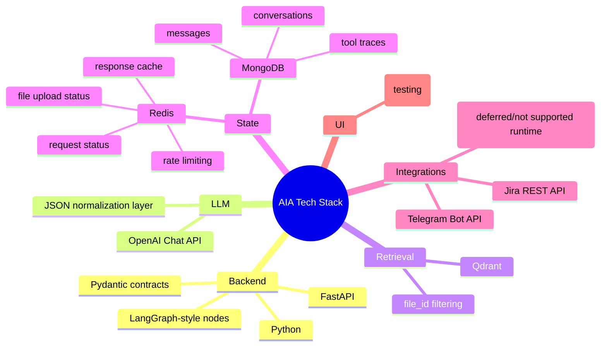

## 3) End-to-End Runtime Flow

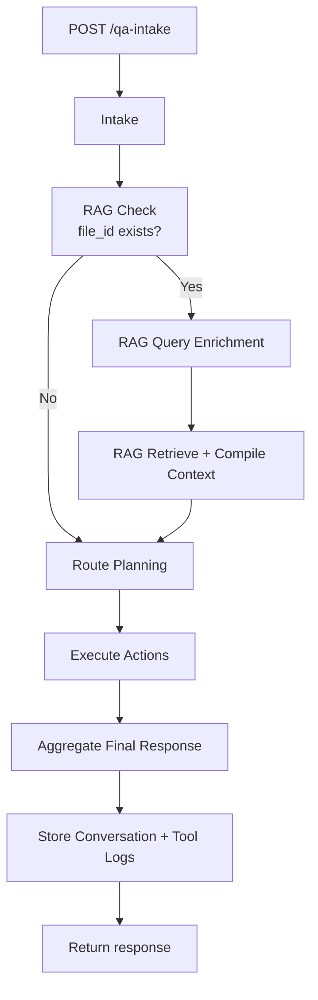

## 3.1) Workflow Orchestrator (Flowchart View)

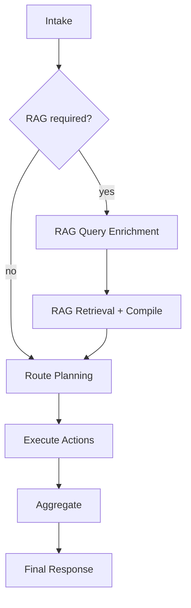

## 3.2) Workflow Orchestrator (Sequence View)

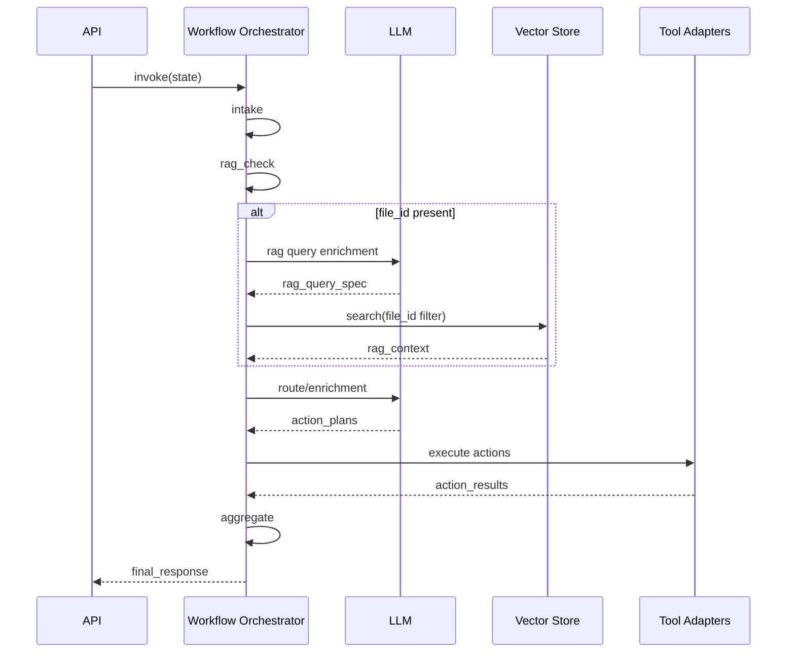

## 4) Upload + File Processing Pipeline

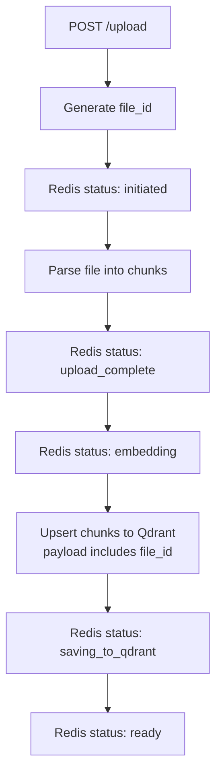

## 5) Action Execution Model (with dependency handling)

```mermaid
flowchart TD
  P[route_plan.action_plans] --> L{for each action}
  L --> M[Check depends_on success]
  M -- blocked --> N[Mark skipped]
  M -- ok --> O[Enrich params with request + RAG context]
  O --> O2[Precheck/sanitize params\n(chat_id, jira fields)]
  O2 --> Q{system}
  Q -- jira --> R[Jira client execute_action]
  Q -- telegram --> S[Telegram client execute_action]
  Q -- slack --> T[Return not supported]
  R --> V[Collect ActionResult]
  S --> V
  T --> V
  N --> V
  V --> W[Append errors + action_data]
```

## 5.1) Action Execution Layer (Sequence View)

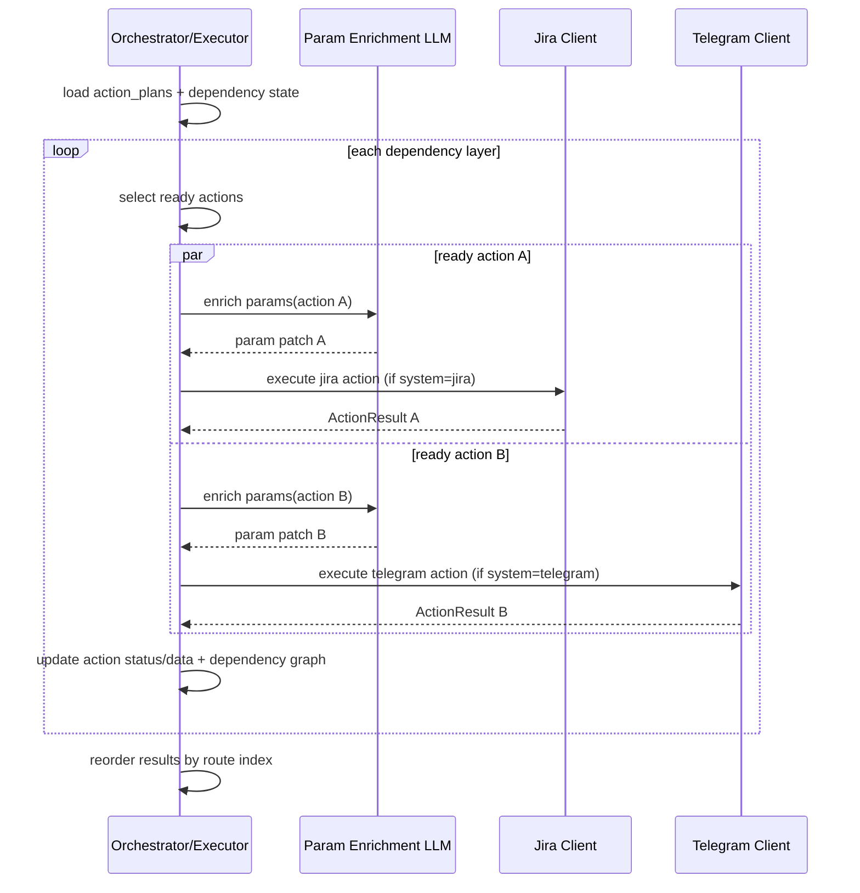

## 6) RAG Retrieval Algorithm (file-scoped)

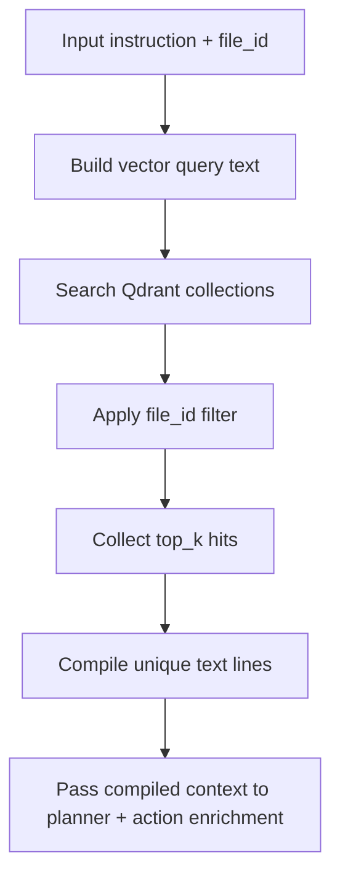

## 6.0) Retrieval (Sequence View)

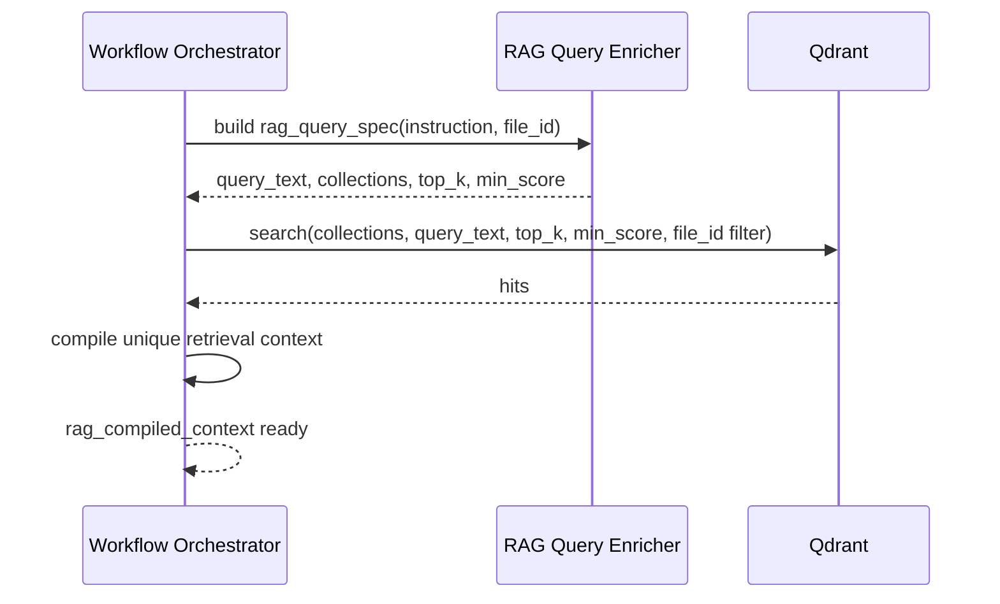

## 6.1) Enrichment Diagram - RAG Query Enrichment

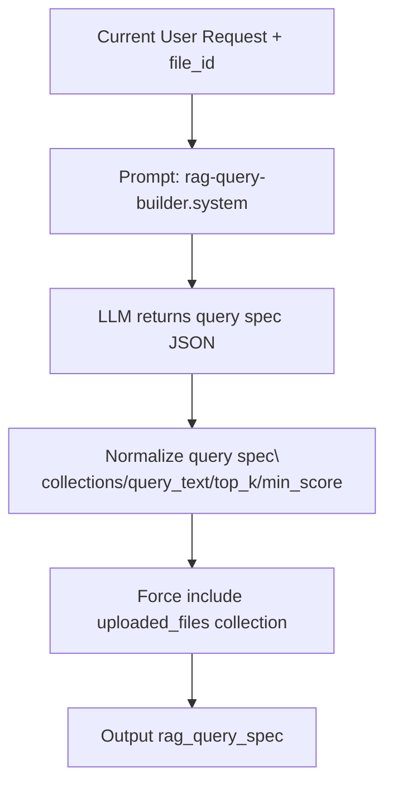

## 6.2) Enrichment Diagram - Action Parameter Enrichment

```mermaid
flowchart TD
  A1[action from route_plan] --> A2[Build enrichment prompt\\n(request + rag_compiled_context + existing params)]
  A2 --> A3[LLM returns param patch JSON]
  A3 --> A4[Merge with existing params]
  A4 --> A5[Sanitize protected fields\\n(e.g., telegram chat_id)]
  A5 --> A6[Precheck by action type\\n(jira create/assign requirements)]
  A6 --> A7[Ready for tool execution]
```

## 6.3) Enrichment (Sequence View)

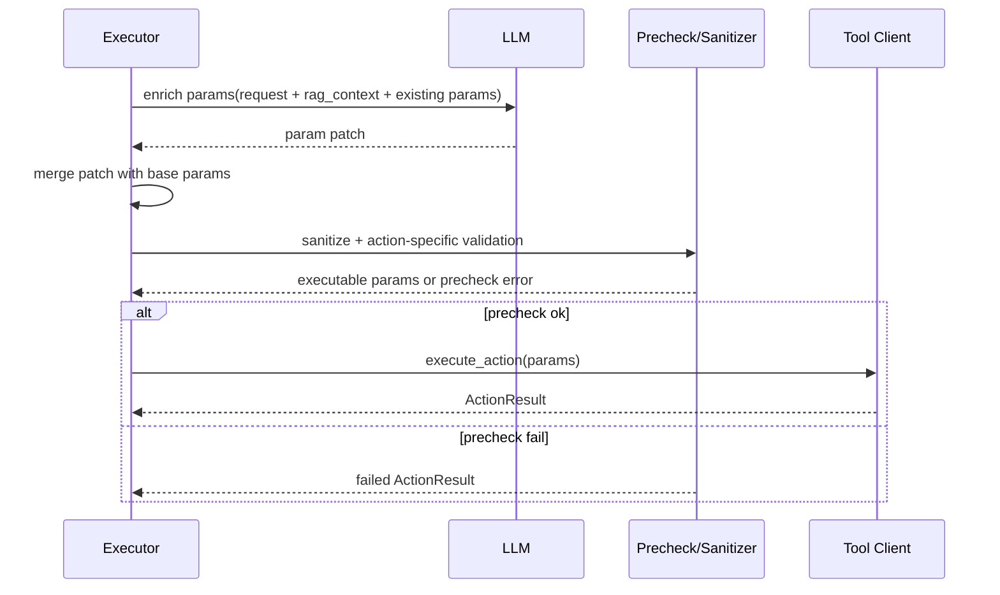

## 7) Routing Policy Rules (intent guardrails)

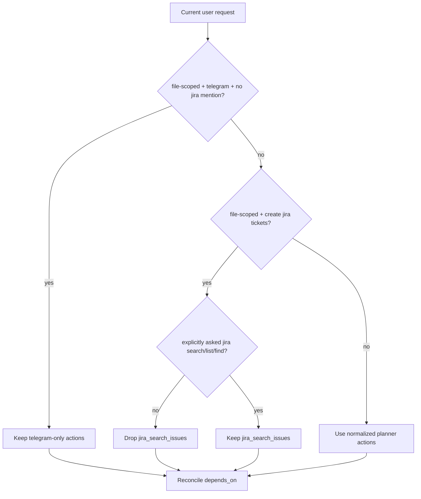

## 8) Data Model (core records)

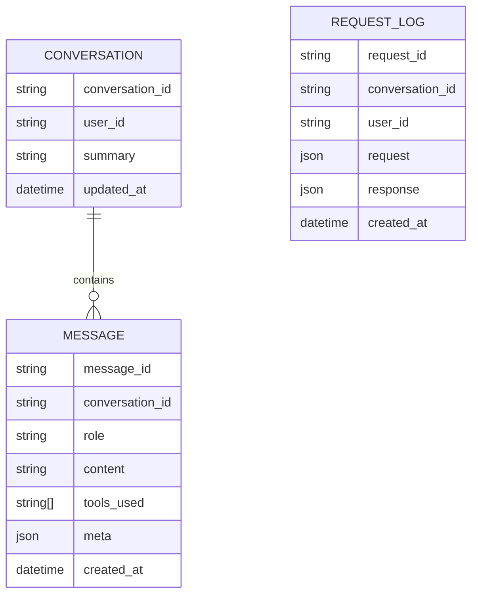

## 9) Cache + Status Strategy

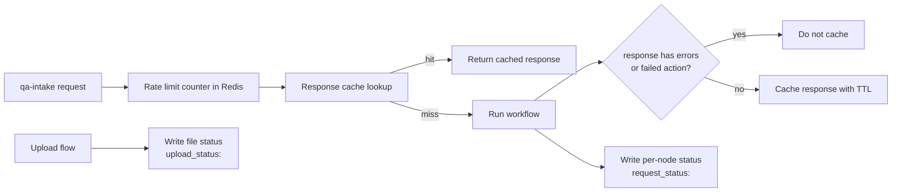

## 9.1) Redis (Sequence View)

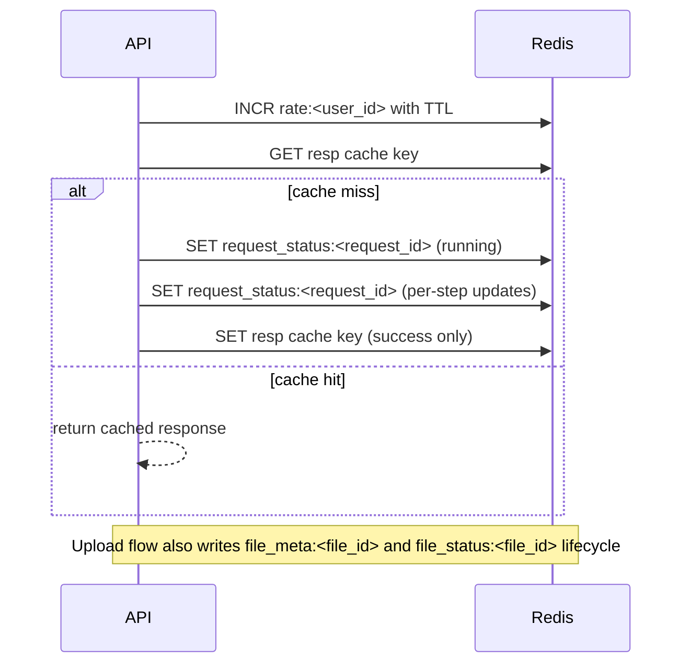

## 9.2) MongoDB Memory (Sequence View)

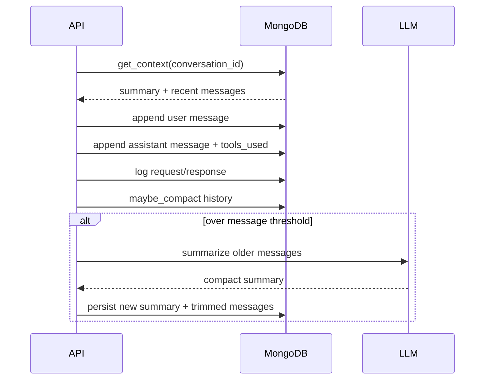

## 10) Telegram Safety Logic

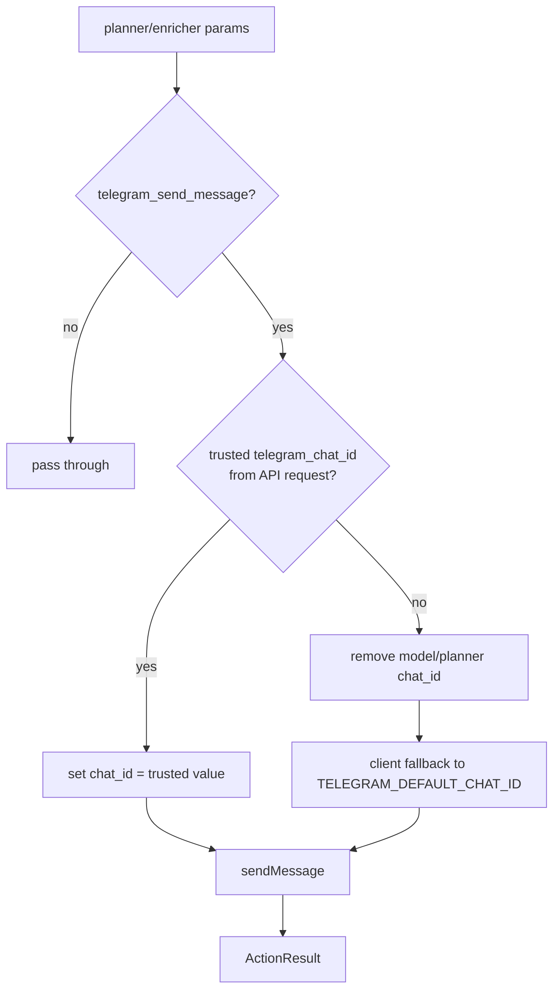

## 11) Jira Scope Migration Logic (Project -> Space)

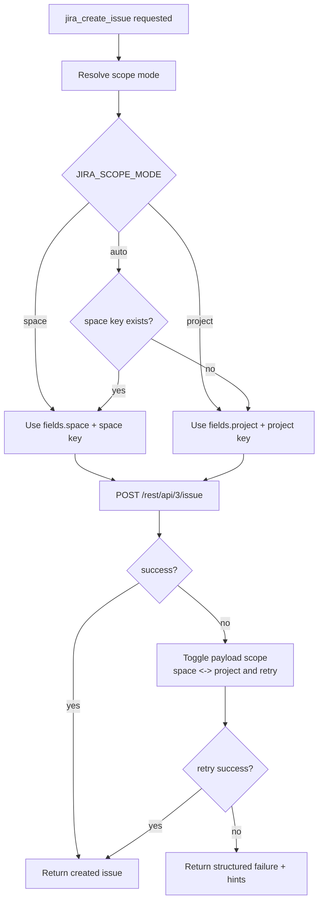

## 12) Jira Search Compatibility Fallback

```mermaid
sequenceDiagram
  participant WF as Workflow
  participant JC as Jira Client
  participant J as Jira API

  WF->>JC: jira_search_issues(params)
  JC->>J: POST /rest/api/3/search/jql
  alt success
    J-->>JC: 200
    JC-->>WF: success
  else fail
    JC->>J: GET /rest/api/3/search/jql
    alt success
      J-->>JC: 200
      JC-->>WF: success
    else fail
      JC->>J: POST /rest/api/3/search
      alt success
        J-->>JC: 200
        JC-->>WF: success
      else fail
        JC->>J: GET /rest/api/3/search
        J-->>JC: 4xx
        JC-->>WF: failed with error details
      end
    end
  end
```

## 13) Reliability Loop (Bug-to-Fix Lifecycle)

```mermaid
flowchart LR
  B1[Production/Test Failure] --> B2[Capture trace + symptom]
  B2 --> B3[Root cause analysis]
  B3 --> B4[Patch code + prompt + policy]
  B4 --> B5[Add regression tests]
  B5 --> B6[Update ERROR_LOG.md]
  B6 --> B7[Release + monitor]
  B7 --> B1
```

## 14) Deployment Topology (Docker Compose)

```mermaid
flowchart LR
  subgraph Compose
    API[aia-api]
    REDIS[aia-redis]
    MONGO[aia-mongo]
    QDRANT[aia-qdrant]
  end

  API --> REDIS
  API --> MONGO
  API --> QDRANT
  API --> OPENAI[OpenAI API]
  API --> JIRA[Jira Cloud]
  API --> TG[Telegram API]
```

## 15) Concurrency Mode Switch (Sequential vs Parallel)

```mermaid
flowchart TD
  A[execute_actions node] --> B{accept_parallel override?}
  B -- yes --> C[Use request value]
  B -- no --> D[Read ACCEPT_PARALLEL env]
  C --> E{parallel enabled?}
  D --> E
  E -- no --> F[Sequential executor]
  E -- yes --> G[Dependency-aware parallel executor]
```

## 15.1) Concurrency/Parallelism (Sequence View)

```mermaid
sequenceDiagram
  participant API as API
  participant EX as Executor
  participant CFG as Config/State

  API->>EX: execute_actions(state)
  EX->>CFG: check accept_parallel override
  alt override provided
    CFG-->>EX: use request value
  else no override
    EX->>CFG: read ACCEPT_PARALLEL env
    CFG-->>EX: env default
  end
  alt parallel enabled
    EX-->>EX: run dependency-layer parallel path
  else sequential
    EX-->>EX: run sequential path
  end
```

## 16) Dependency-Layer Parallel Executor

```mermaid
flowchart TD
  S1[Pending actions] --> S2[Select ready set\\nall depends_on satisfied]
  S2 --> S3{ready set exists?}
  S3 -- yes --> S4[Execute ready actions concurrently]
  S4 --> S5[Store ActionResult + update statuses]
  S5 --> S1
  S3 -- no --> S6{pending actions remain?}
  S6 -- no --> S7[Finish]
  S6 -- yes --> S8[Mark unresolved dependency actions skipped]
```

## 17) Parallel-Eligible vs Sequential Scenarios

```mermaid
flowchart LR
  subgraph ParallelEligible
    P1[jira_create_issue]
    P2[telegram_send_message]
    P1 --- P2
    P3[depends_on=[]]
  end

  subgraph SequentialRequired
    S1[jira_search_issues] --> S2[telegram_send_message summary]
    S3[jira_create_issue] --> S4[jira_assign_issue]
  end
```

## 18) Automatic Grouping Strategy (Route -> Runtime)

```mermaid
sequenceDiagram
  participant RT as Route Planner
  participant EX as Executor

  RT->>EX: action_plans + depends_on
  EX->>EX: Build dependency graph
  EX->>EX: Compute execution layers
  alt parallel enabled
    EX->>EX: Run actions in same layer concurrently
    EX->>EX: Run next layer after prior layer completes
  else sequential mode
    EX->>EX: Run by route order
  end
  EX->>EX: Reorder outputs to original action index
```

## 19) Timing and UX Observability

```mermaid
flowchart TD
  U1[Streamlit request start] --> U2[Poll /qa-intake/{request_id}/status]
  U2 --> U3[Render current node state]
  U2 --> U4[Compute total runtime]
  U2 --> U5[Compute per-step durations\\nstarted_at -> finished_at]
  U5 --> U6[Show Detail per step]
```
