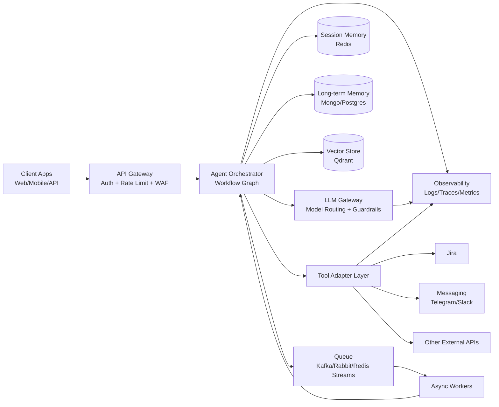
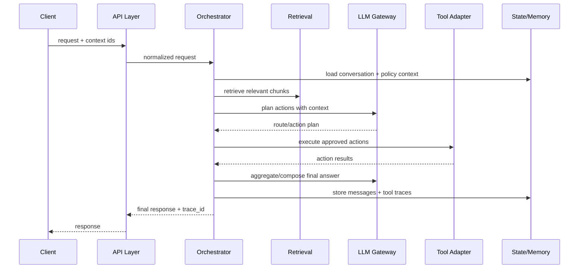
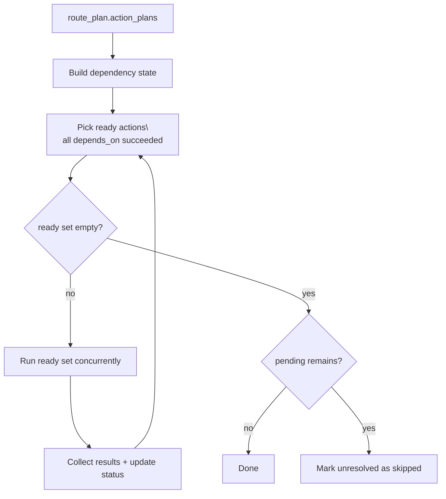

# Build Architecture for a Production-Scale AI Agent
## Core Components, Interactions, and Scalability Patterns

**Audience:** engineers, architects, tech leads  
**Goal:** design an AI Agent system that is reliable, observable, secure, and scalable in production.

---

## 1. Why Production Architecture Matters
- Demo agents optimize for quick results.
- Production agents optimize for:
  - reliability
  - latency and throughput
  - safety and governance
  - cost control
  - debuggability

---

## 2. What Is a Production AI Agent?
An AI Agent is a system that can:
- interpret user intent
- retrieve and reason over context
- plan actions
- execute tools/services
- return traceable outcomes

In production, this must happen with strict controls and observability.

---

## 3. Core Components (High Level)
- **API Gateway + Auth**
- **Orchestration Engine** (workflow graph/state machine)
- **LLM Gateway** (models, prompts, fallback)
- **Memory Layer** (session + long-term)
- **Knowledge Layer** (RAG/vector + documents)
- **Tooling Layer** (Jira/Telegram/CRM/etc.)
- **Policy & Safety Layer**
- **Observability Layer**
- **Async Execution Layer** (queues/workers)

---

## 4. Reference Production Architecture

---

## 5. Component Interaction Pattern

---

## 6. Orchestration Layer Design
- Use explicit nodes (state-machine / graph), not ad-hoc chains.
- Separate stages:
  - intake
  - context decision
  - retrieval
  - planning
  - execution
  - aggregation
- Persist per-node status for UI and debugging.

---

## 7. LLM Gateway Responsibilities
- model routing by task type
- structured output enforcement
- retry and fallback models
- prompt versioning
- token/cost tracking
- timeout and circuit-breaker policy

---

## 8. RAG Architecture for Production
- deterministic chunking + metadata strategy
- hybrid retrieval (dense + keyword optional)
- tenant and file-level filters
- prompt-grounding with retrieval context
- cache hot retrieval paths

---

## 9. Memory Architecture
- **Short-term memory:** active request/session context (Redis)
- **Long-term memory:** conversations, tool traces, summaries (Mongo/Postgres)
- **Compaction strategy:** summary + keep-recent window
- **Avoid context bloat:** strict token budgets + relevance filtering

---

## 10. Tool Adapter Layer
- Build each integration behind a stable internal interface.
- Normalize action names and payload schema.
- Add provider-specific compatibility fallbacks.
- Return structured `ActionResult` with status/data/error.

---

## 11. Policy & Safety Layer
- action allow-list by role/environment
- risk tiering (low/medium/high)
- approval gates for destructive actions
- output/content filters
- secret redaction in logs

---

## 12. Scalability Strategy
- stateless API services (horizontal scale)
- queue-backed async workloads
- idempotency keys for tool actions
- shard/vector partitioning by tenant
- backpressure + retry with jitter

---

## 13. Deep Dive - Concurrency/Parallelism Architecture
- Execution mode:
  - `ACCEPT_PARALLEL=false`: sequential mode
  - `ACCEPT_PARALLEL=true`: dependency-aware parallel mode
  - per-request override: `accept_parallel`
- Parallel rule:
  - actions in the same satisfied dependency layer run concurrently
- Sequential rule:
  - layers execute in order; dependent actions wait for parent layer completion
- Determinism:
  - keep final `action_results` in original route order

---

## 14. Deep Dive - Dependency DAG Execution Pattern

---

## 15. Deep Dive - Automatic Grouping Strategy
- Route-time + runtime cooperation:
  - route declares dependencies (`depends_on`)
  - runtime computes dependency layers automatically
- Grouping output:
  - `parallel groups`: actions in same layer
  - `sequential groups`: layer boundaries with dependencies
- Benefit:
  - PM/PDM get lower latency without sacrificing correctness.

---

## 16. Reliability Patterns
- graceful degradation when services fail
- per-integration timeout budgets
- circuit breakers on unstable providers
- cache only successful deterministic responses
- dependency-aware action skipping

---

## 17. Observability & Operations
Track at least:
- p50/p95 latency per node
- tool success/failure rate
- retrieval hit quality metrics
- token usage + cost per request
- top failure signatures by integration

---

## 18. Concurrency KPIs (What PM/PDM Should Track)
- End-to-end latency delta: sequential vs parallel mode
- % requests with parallel-eligible action sets
- % requests blocked by dependency chains
- Failure propagation rate (parent failed -> child skipped)
- User-perceived completion time in UI

---

## 19. Security Architecture
- OAuth/API key management via secret manager
- RBAC for actions/tools
- request validation + schema constraints
- audit logs for every external action
- data retention + PII controls

---

## 20. CI/CD and Environment Strategy
- schema and contract tests in CI
- integration smoke tests against staging services
- feature flags for new route/tool behaviors
- canary deployment + automated rollback

---

## 21. Failure Case Examples (Real)
- schema mismatch from LLM output -> normalize before validate
- unsupported action names -> strict catalog + alias map
- provider endpoint drift -> multi-path fallback
- routing drift from intent ambiguity -> rule-based policy layer

---

## 22. Performance and Cost Controls
- prompt/context size budgets
- response caching policy
- retrieval candidate limits
- model tiering (cheap model for routing, stronger model for synthesis)
- periodic cost anomaly alerts

---

## 23. Maturity Roadmap
1. **MVP:** synchronous orchestration + basic tools  
2. **Production v1:** observability + policy + retries + memory compaction  
3. **Production v2:** async jobs + approvals + multi-tenant isolation  
4. **Enterprise:** SLOs, governance, compliance, audit automation

---

## 24. Key Takeaways
- Production AI agents are architecture problems, not only prompt problems.
- Core success factors:
  - explicit orchestration
  - strict contracts
  - robust integration adapters
  - observability and policy controls
- Build for failure paths first, then optimize happy paths.
