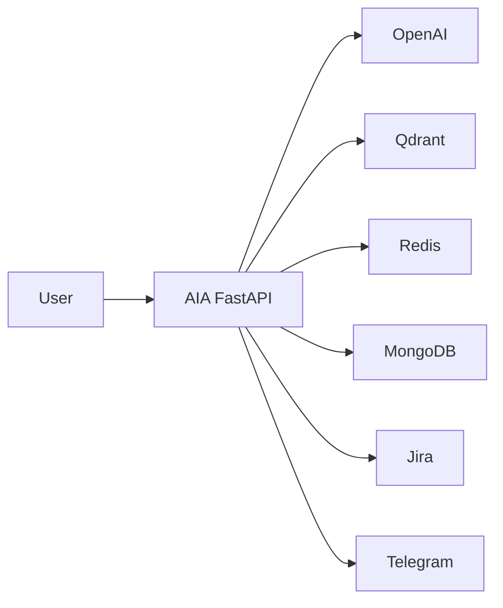
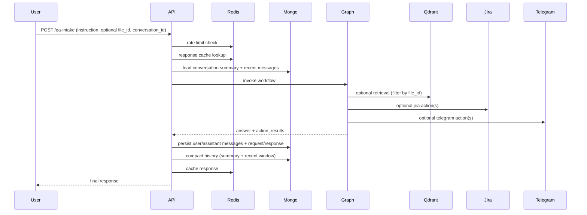
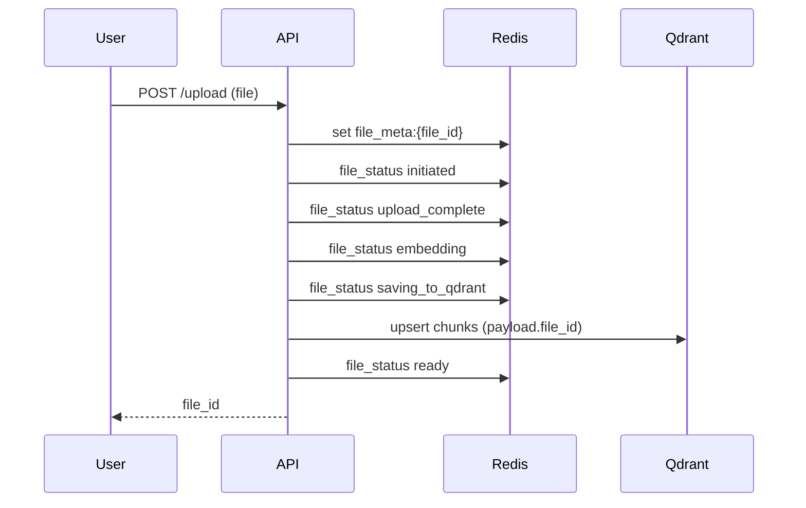

# Architecture Diagrams Addendum

## 1. System Context


## 2. Main Request Flow (`/qa-intake`)


## 3. Upload Flow (`/upload`)


## 4. Upload Status/Metadata Endpoints
```mermaid
flowchart LR
    Client --> S1[GET /upload/{file_id}/status]
    Client --> S2[GET /upload/{file_id}]
    S1 --> Redis
    S2 --> Redis
```
