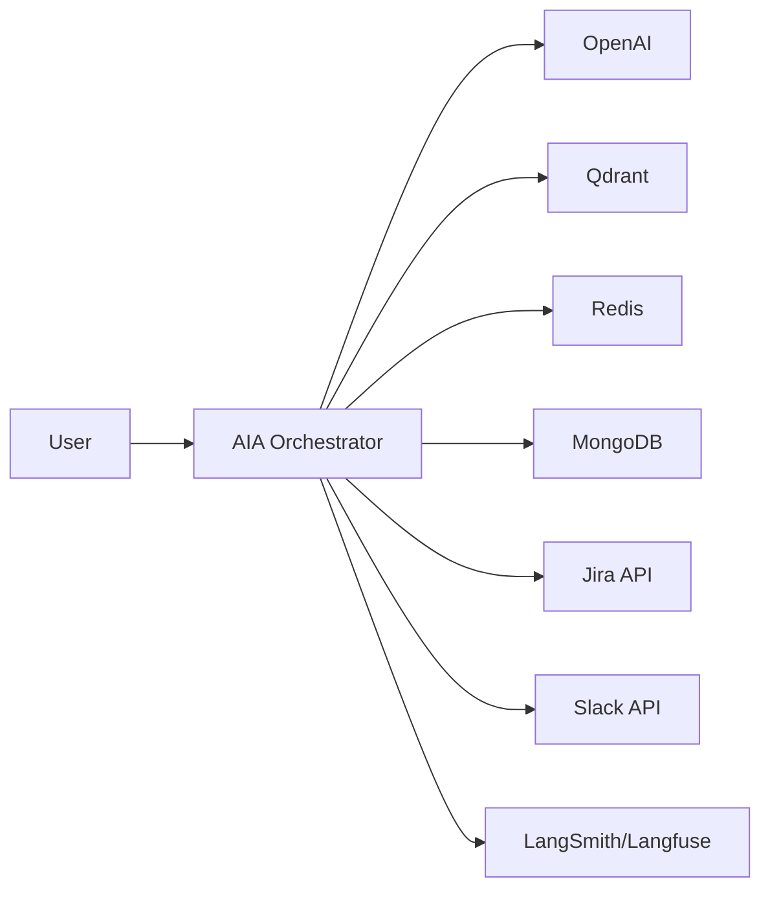
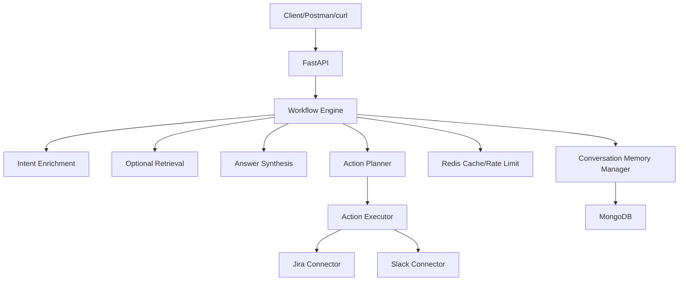
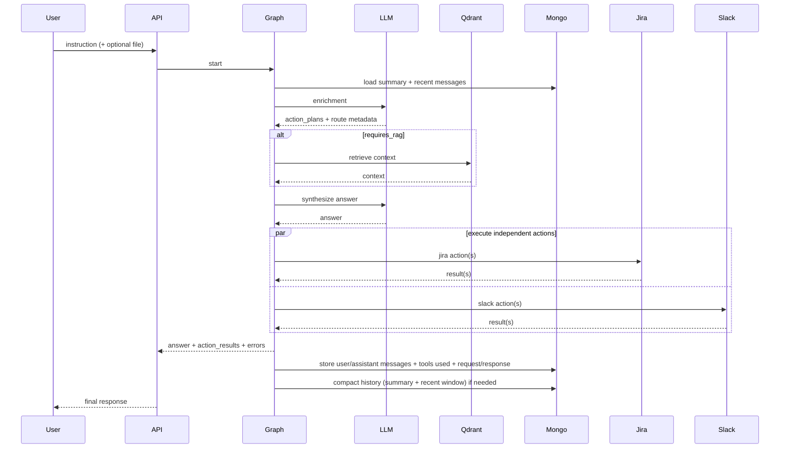
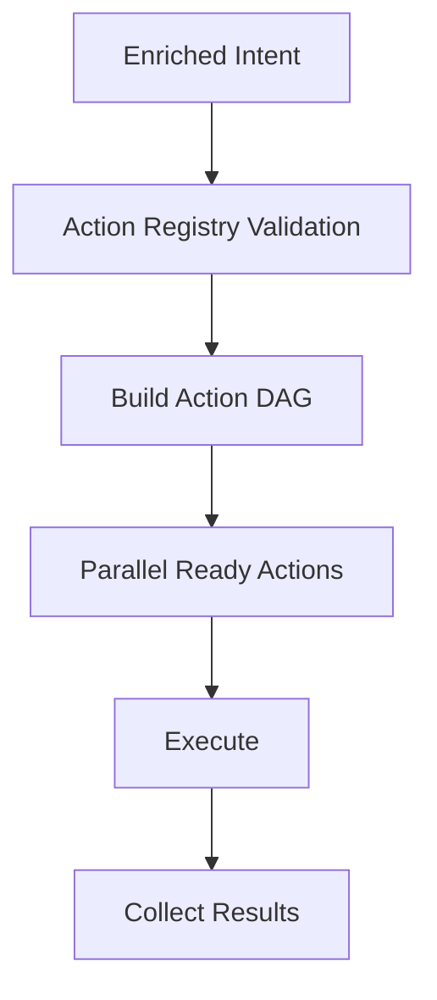
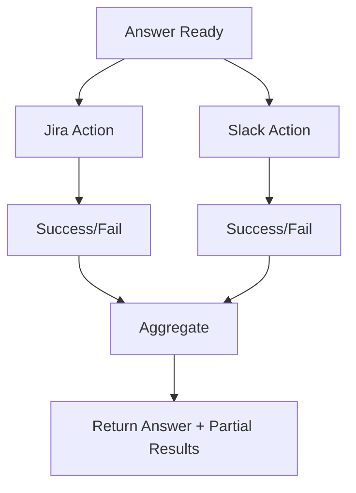
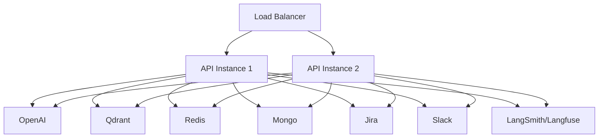

# Architecture Diagrams Addendum

## 1. Usage
- This document is diagrams-only.
- Canonical behavior is defined in `docs/TDD.md`.

## 2. System Context

## 3. Container View

## 4. End-to-End Sequence

## 5. Action Planner and DAG

## 6. Failure Isolation

## 7. Deployment Topology

