# Architecture Diagrams Addendum

## 1. System Context
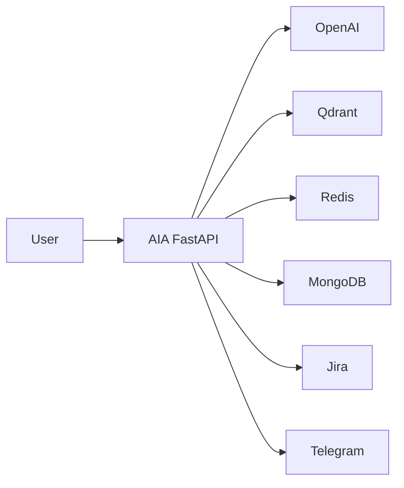

## 2. Main Request Flow (`/qa-intake`)
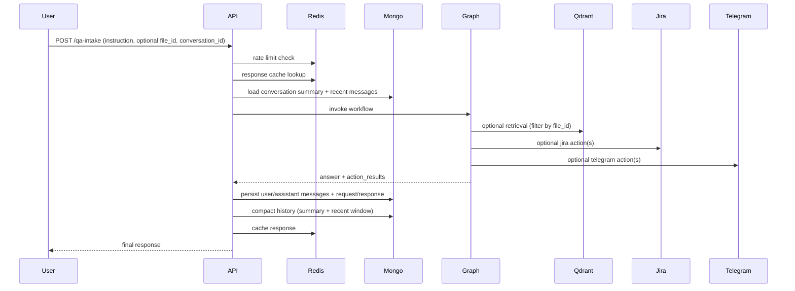

## 2.1 Workflow Orchestrator Flowchart
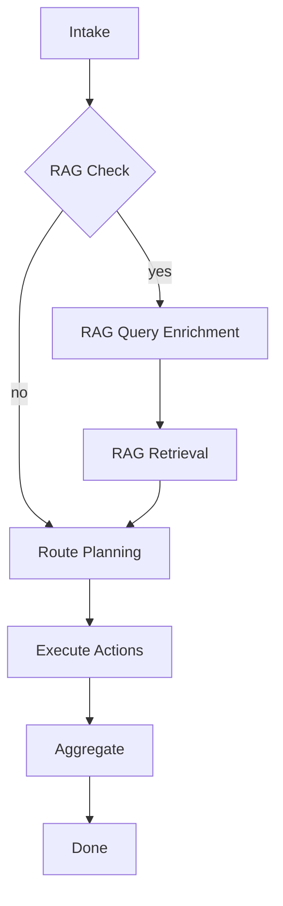

## 2.2 Workflow Orchestrator Sequence
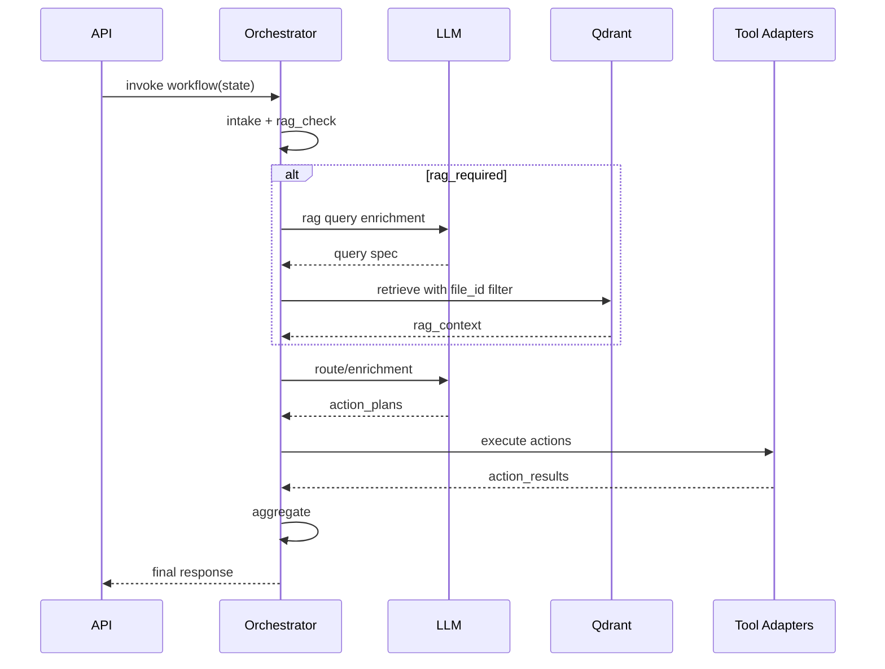

## 3. Upload Flow (`/upload`)
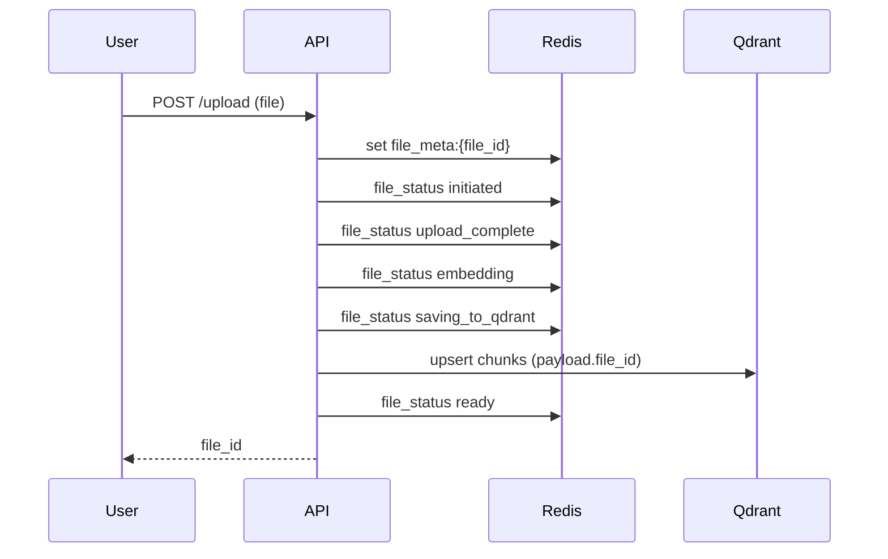

## 4. Upload Status/Metadata Endpoints
```mermaid
flowchart LR
    Client --> S1[GET /upload/{file_id}/status]
    Client --> S2[GET /upload/{file_id}]
    S1 --> Redis
    S2 --> Redis
```

## 4.1 Redis Sequence (Rate Limit, Cache, Status)
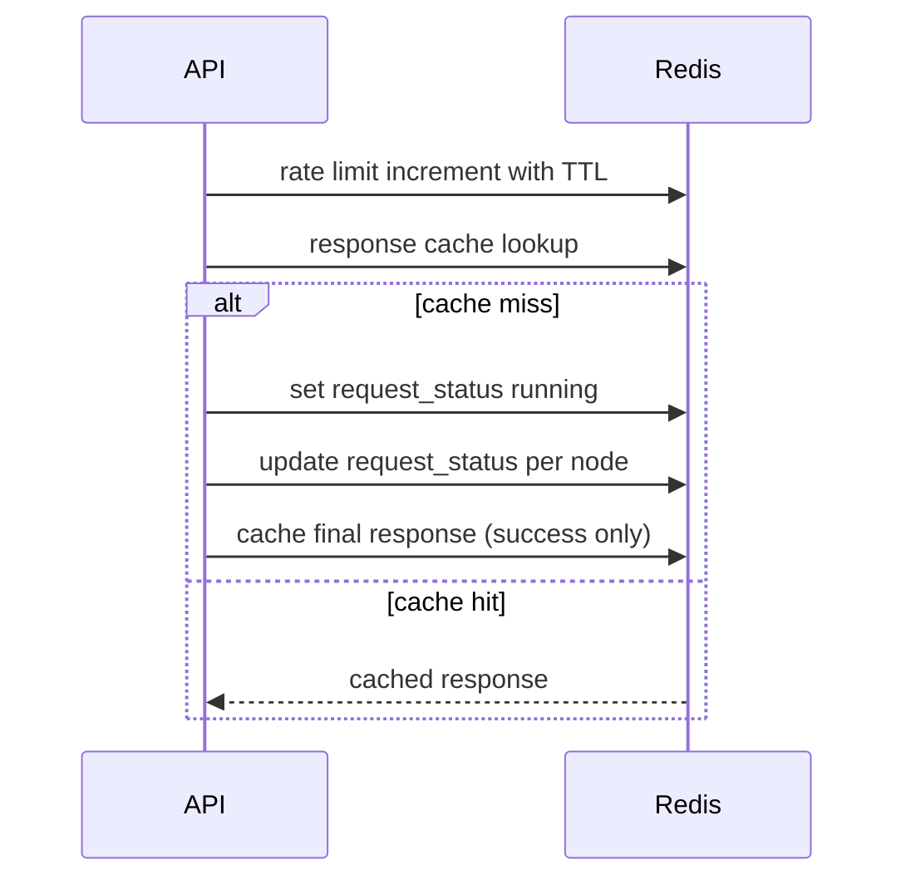

## 4.2 MongoDB Sequence (Conversation Memory)
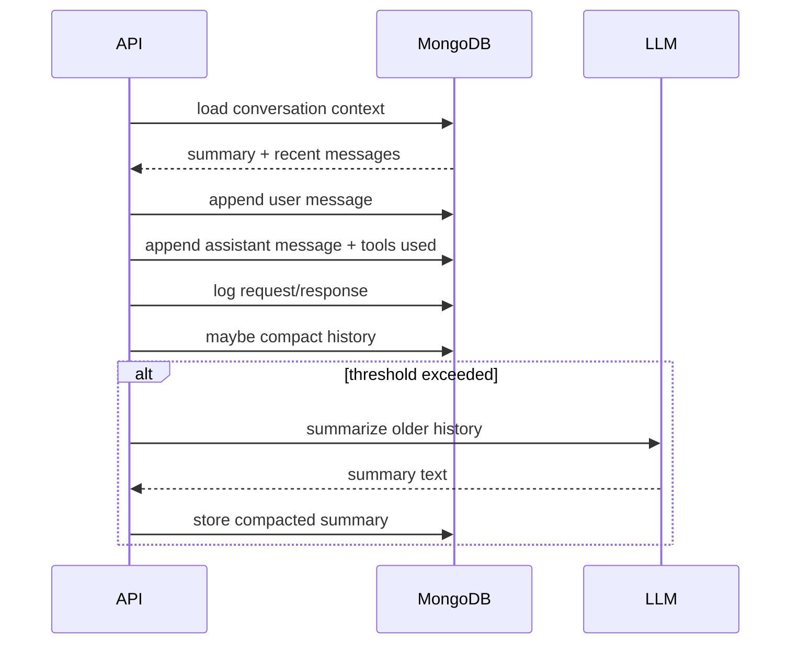

## 5. Action Execution Algorithm (Sequential vs Parallel)
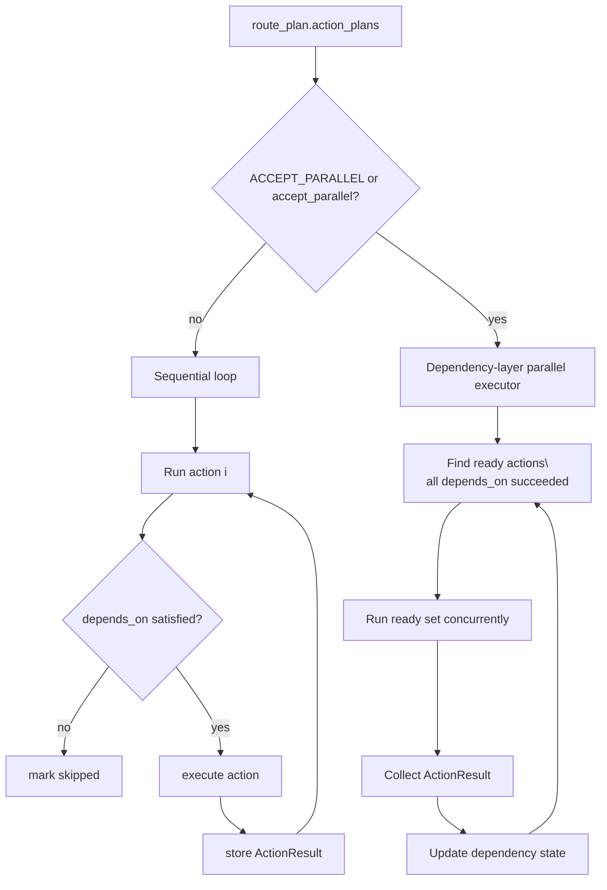

## 5.1 Action Execution Sequence
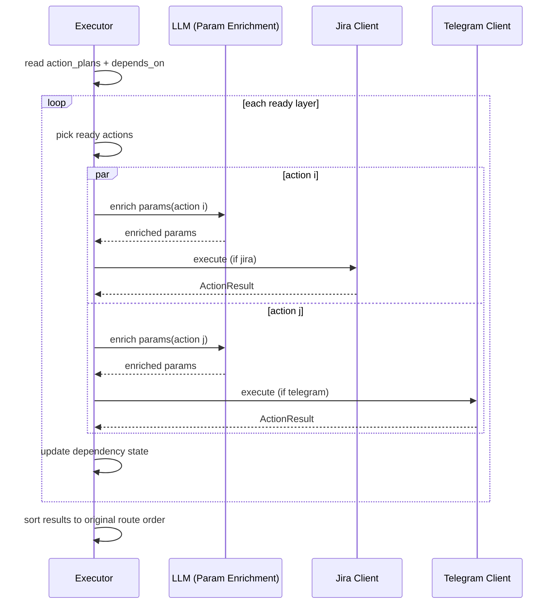

## 6. Parallel-Eligible vs Sequential Patterns
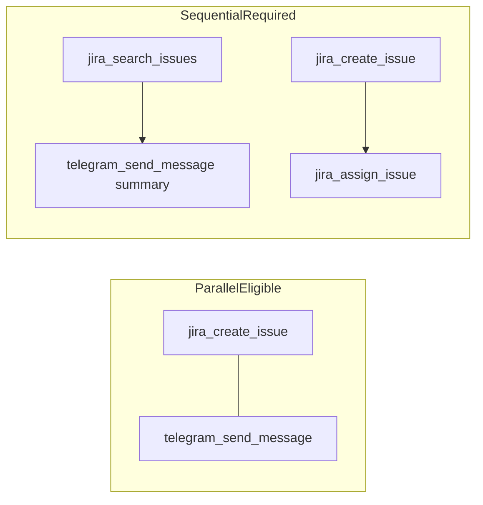

## 7. Automatic Grouping by Dependency Layers
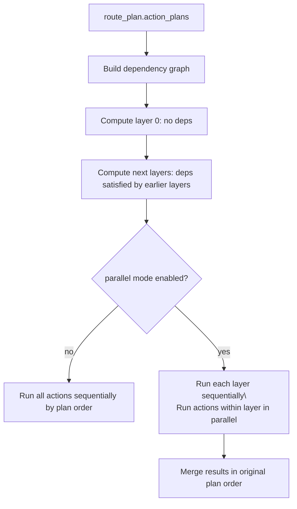

## 8. Enrichment Flows
### 8.0 Retrieval Sequence
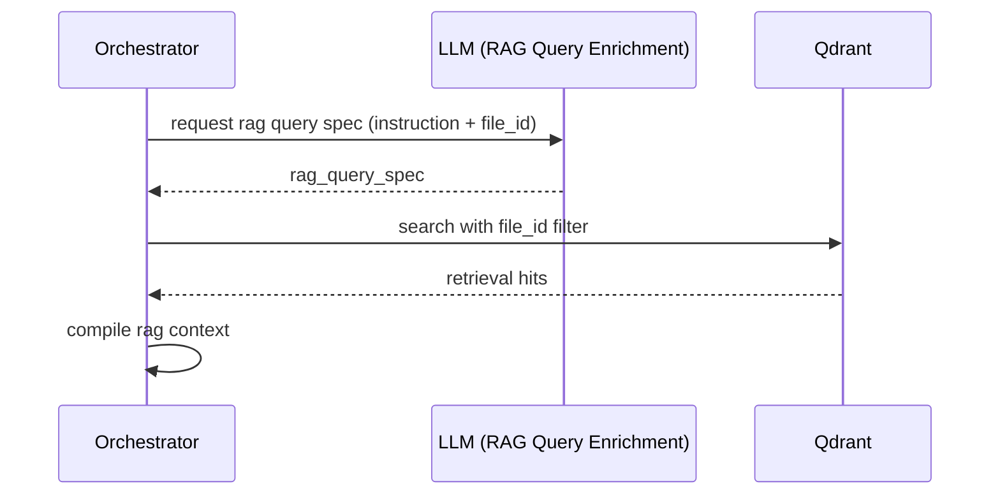

### 8.1 RAG Query Enrichment
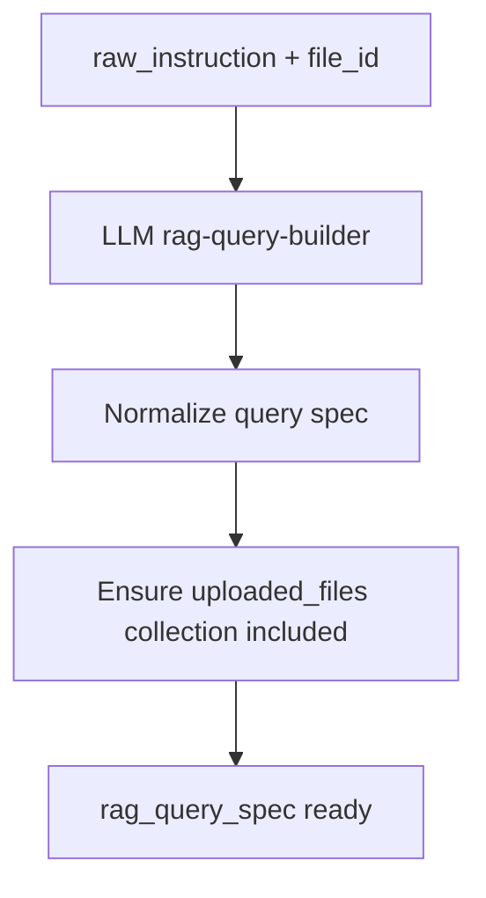

### 8.2 Action Parameter Enrichment
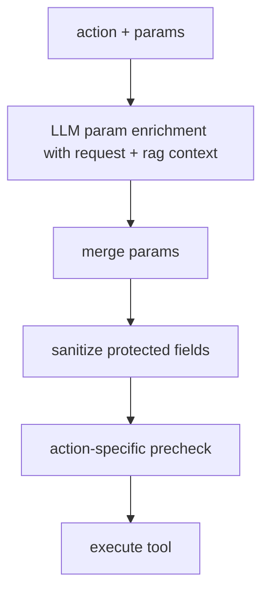

### 8.3 Enrichment Sequence
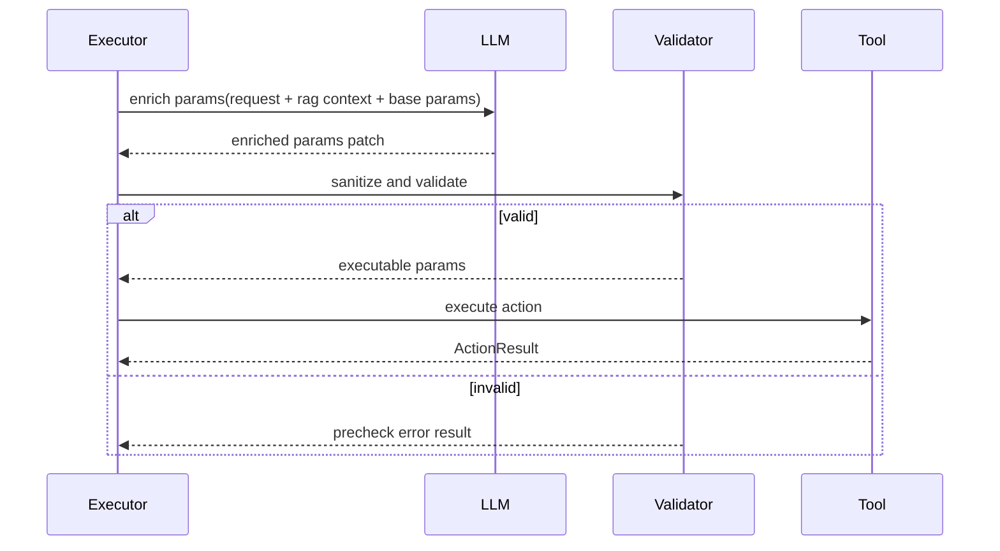
