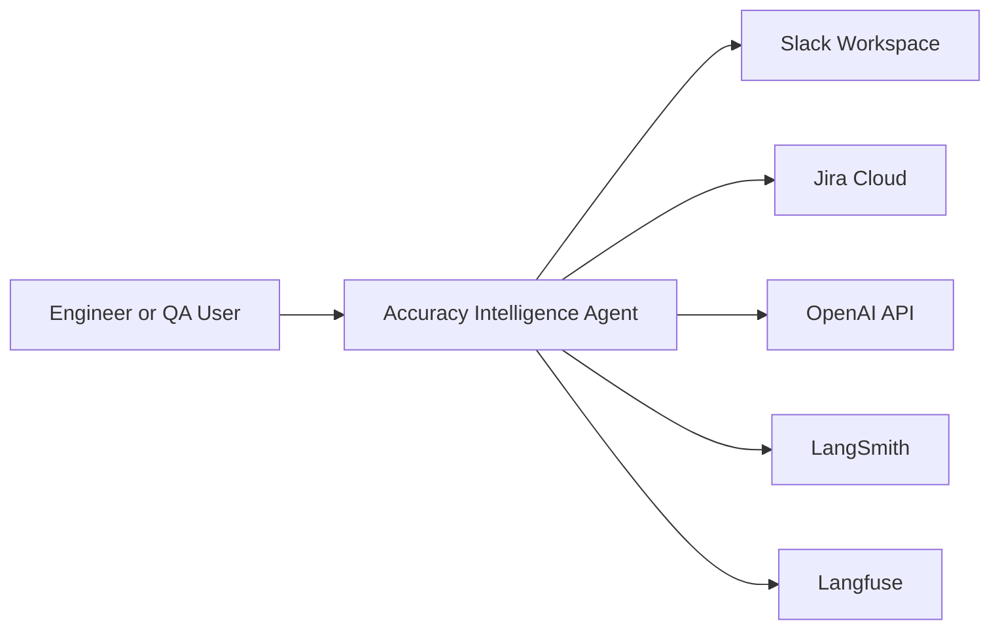
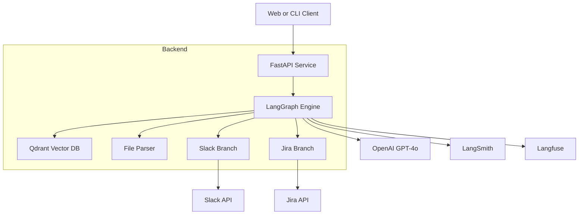
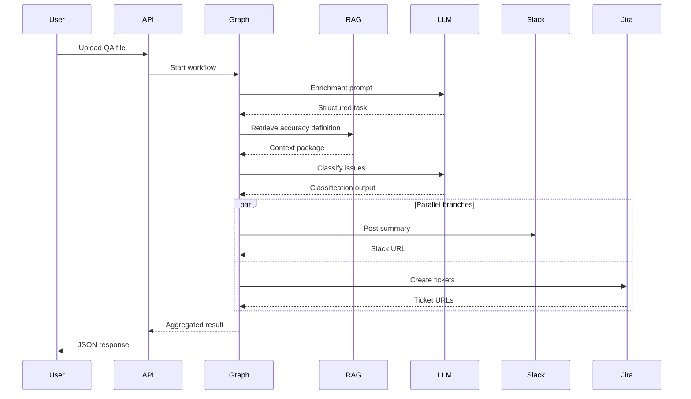
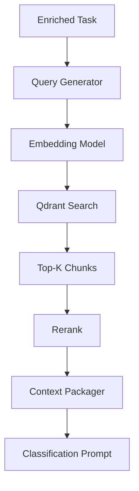
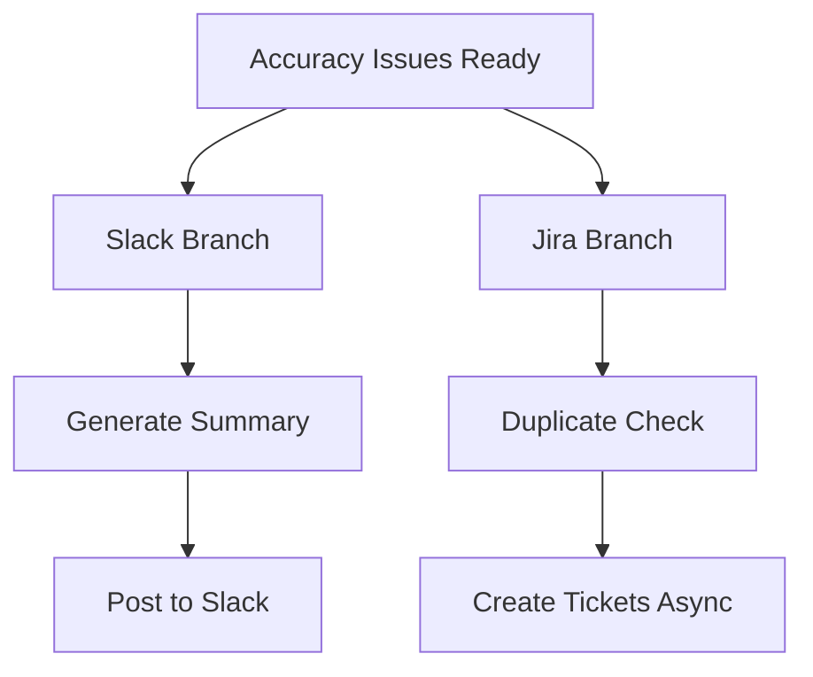
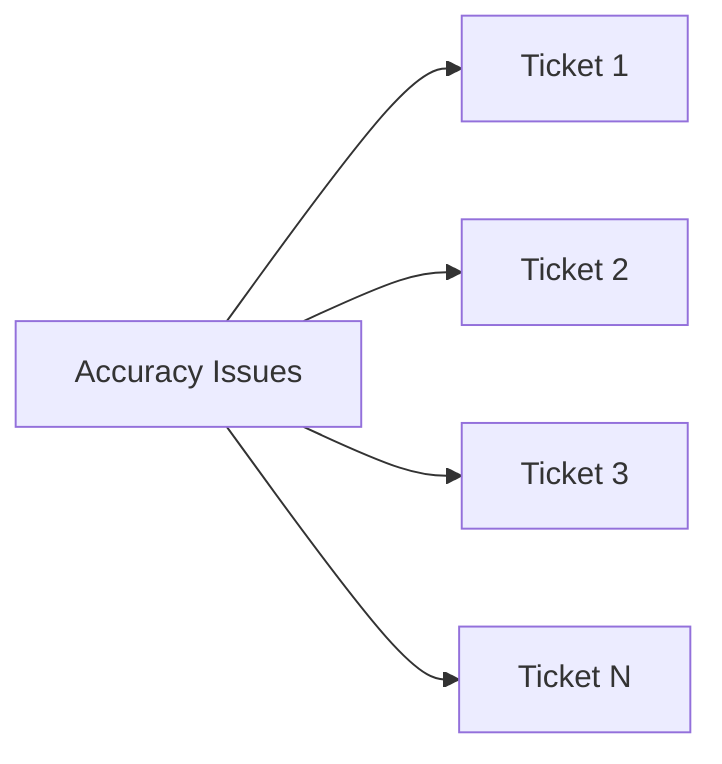
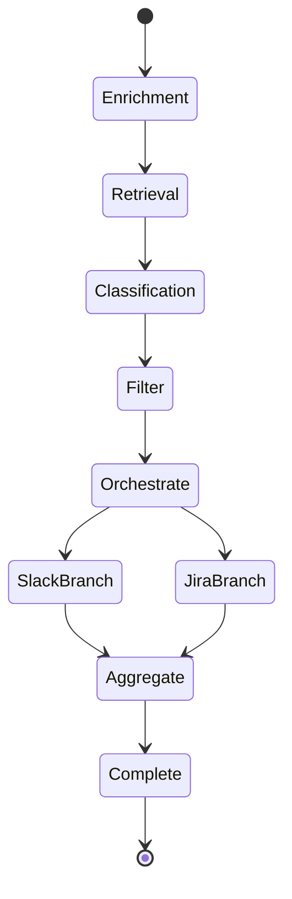
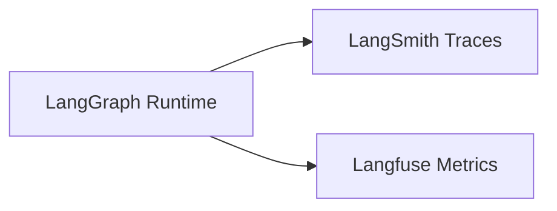
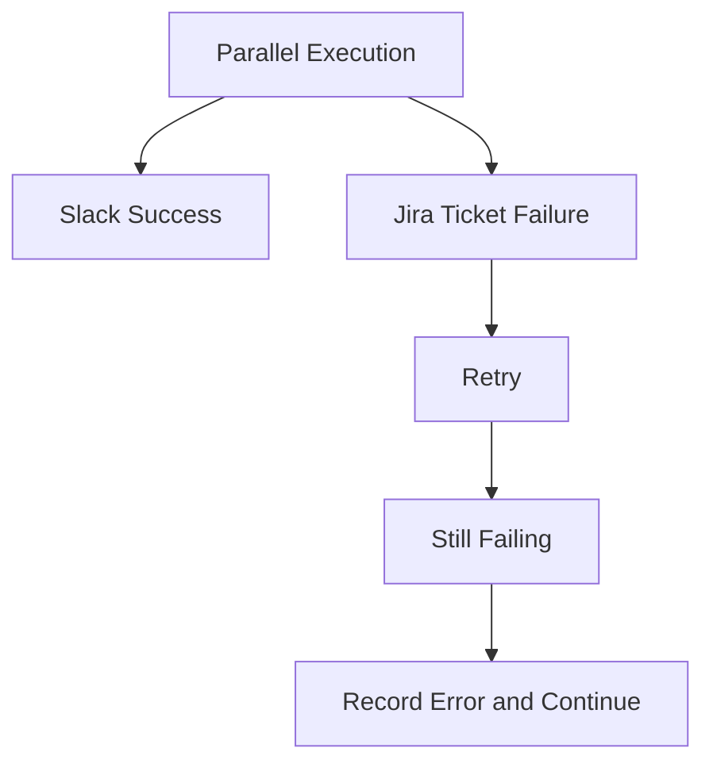
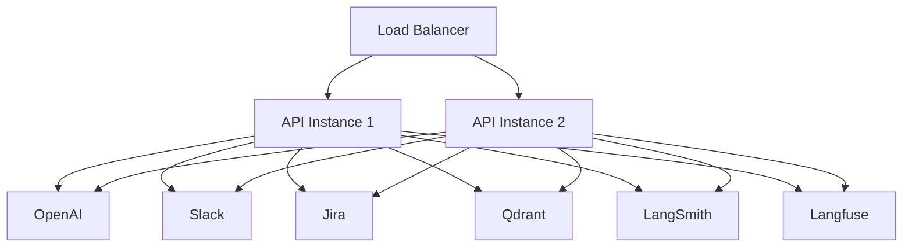

# Architecture Diagrams Addendum

## 1. Usage
- This document is diagrams-only.
- Canonical engineering behavior is defined in `docs/TDD.md`.
- Canonical product scope is defined in `docs/PRD.md`.

## 2. System Context (C4 Level 1)

## 3. Container View (C4 Level 2)

## 4. End-to-End Sequence

## 5. RAG Pipeline

## 6. Concurrency Model

## 7. State Machine

## 8. Observability Topology

## 9. Failure Isolation

## 10. Deployment Topology

